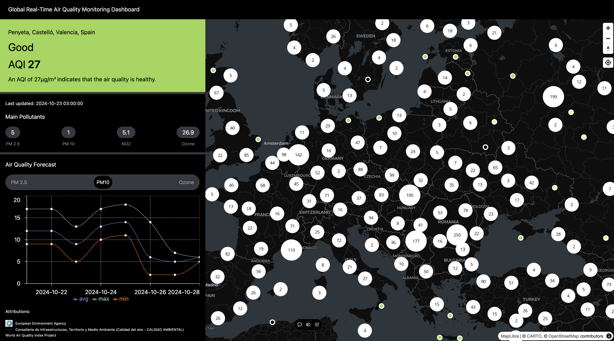

## Developing an Air Quality Dashboard using React, Tailwind CSS, TypeScript and Maplibre GL JS.

Conference: [Geomundus Conference 2024](geomundus.org).

This doc is designed for workshop presented at the Geomundus Conference 2024 on October 26th, 2024.

- Code - [https://github.com/jeafreezy/aq-dashboard](https://github.com/jeafreezy/aq-dashboard)
- Dashboard - [https://aq-dashboard.vercel.app/](https://aq-dashboard.vercel.app/)
- Presentation Slides - [Link](https://docs.google.com/presentation/d/1ZgJGLx9GL8l3fs9nZFzqnaUkAGPQ2SR1pphmxKPobks/edit?usp=sharing)
